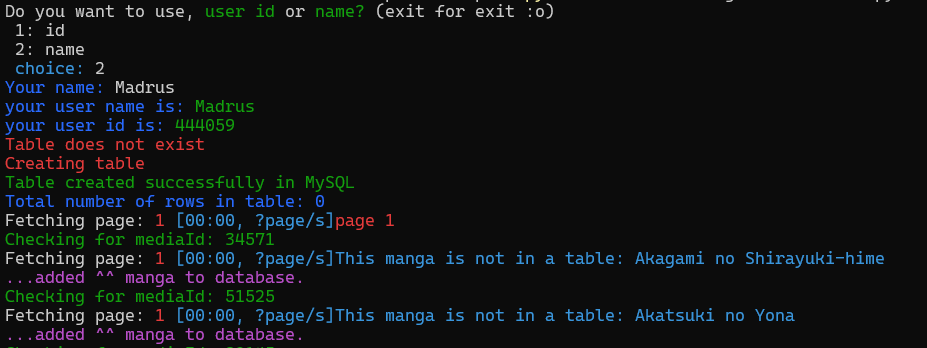
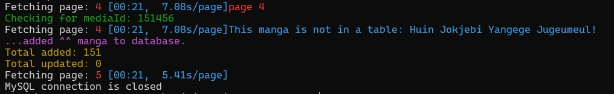
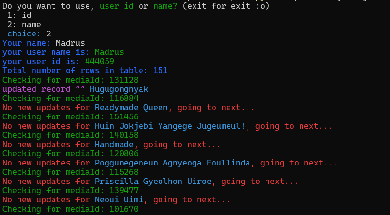
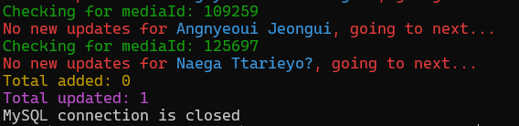

# AniList Backup to MariaDB Database
This Python application allows you to back up your anime and manga lists from the AniList website to a local MariaDB database. The program offers two main functionalities:
1. **Full Backup**: Backs up your complete list of anime/manga.
2. **Recent Update**: Automatically updates the list, adding or changing anime/manga entries until it detects that there are no more new or recently updated items to add.
   
### Screenshots
#### Full Backup
<table>
  <tr>
    <td></td>
    <td></td>
  </tr>
</table>

#### Recent Update
<table>
  <tr>
    <td></td>
    <td></td>
  </tr>
</table>

### Instructions
**Setup**
1. **Configure API Keys**: Rename the file ```api_keys_template.py``` to ```api_keys.py``` and populate it with your credentials:
    ```python
    # MariaDB Configuration
    user_name = ""
    db_password = ""
    host_name = ""  # IP of MariaDB instance
    db_name = ""
    ```

2. Install requirements: (tested on python 3.9.0):
   ```bash 
   pip install -r requirements.txt
3. Now to run just use one of the following files:
* take full anime list:
  ```bash
  python  take_full_anime_list.py
* take full manga list:
  ```bash
  python  take_full_manga_list.py
* update only anime list:
  ```bash
  python  update_only_anime.py
* update only mangalist:
  ```bash
  python  update_only_manga.py
